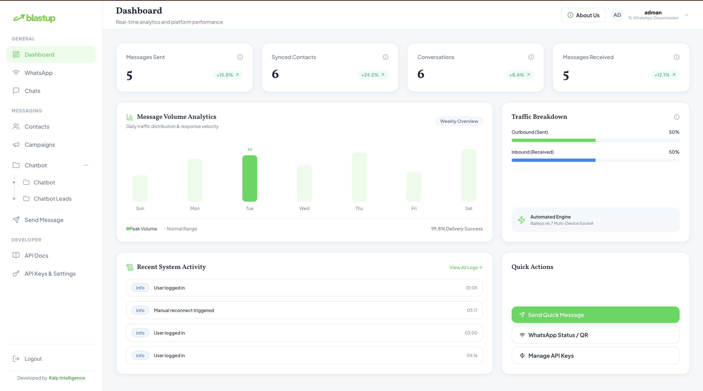
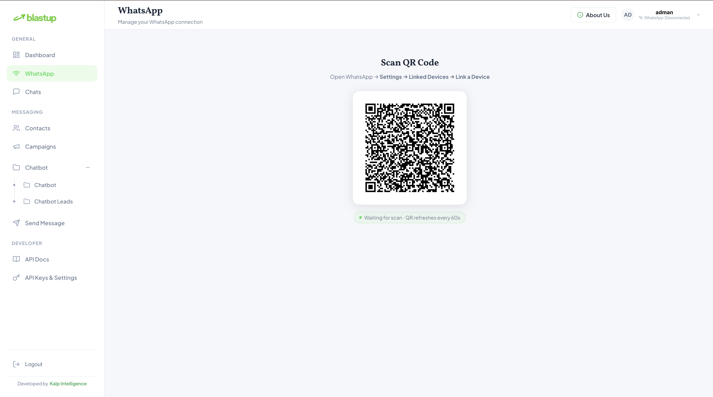
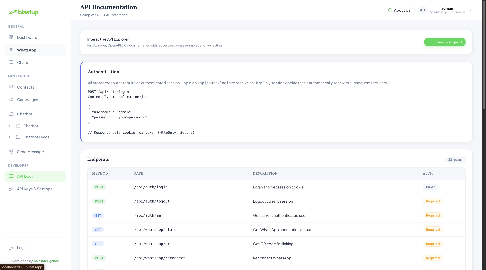
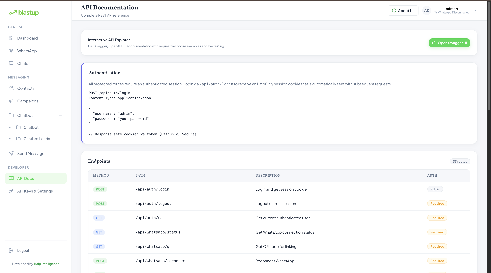

# 🚀 Blastup — Open-Source WhatsApp Automation Platform

<p align="center">
  
</p>

<p align="center">
  <strong>A production-ready, highly secure, and scalable self-hosted WhatsApp automation platform.</strong><br />
  Built with Next.js 14, Node.js/Express, TypeScript, Baileys WebSocket, and MongoDB.
</p>

<p align="center">
  Developed and maintained with ❤️ by <strong><a href="https://kalpintelligence.com">Kalp Intelligence</a></strong>
</p>

<p align="center">
  <a href="https://opensource.org/licenses/MIT"></a>
  <a href="https://nodejs.org/"></a>
  <a href="https://www.typescriptlang.org/"></a>
  <a href="https://nextjs.org/"></a>
  <a href="https://kalpintelligence.com"></a>
</p>

---

## 📖 Table of Contents

- [🌟 Platform Overview](#-platform-overview)
- [⚔️ Why Blastup? (Comparison)](#️-why-blastup-comparison)
- [📸 Platform Screenshots & Demo](#-platform-screenshots--demo)
- [✨ Core Features](#-core-features)
- [⚡ Quick Start (One-Command Setup Wizard)](#-quick-start-one-command-setup-wizard)
- [🛠️ Manual Installation Guide](#-manual-installation-guide)
- [📋 Environment Variables Matrix](#-environment-variables-matrix)
- [🏗️ Architecture & Monorepo Structure](#️-architecture--monorepo-structure)
- [🐳 Production Deployment (Docker & PM2)](#-production-deployment-docker--pm2)
- [💻 API Reference & Code Examples](#-api-reference--code-examples)
- [🤖 Conversational AI & Identity Rules](#-conversational-ai--identity-rules)
- [🛡️ Enterprise Security & SafeMode Antiban](#️-enterprise-security--safemode-antiban)
- [🛠️ Troubleshooting & FAQ](#️-troubleshooting--faq)
- [📄 License & Attribution](#-license--attribution)

---

## 🌟 Platform Overview

**Blastup** is a state-of-the-art open-source WhatsApp automation engine and management dashboard engineered by **[Kalp Intelligence](https://kalpintelligence.com)**.

Unlike proprietary SaaS tools that charge per-message fees or require Meta Cloud API business verification, Blastup connects directly to WhatsApp Web's socket layer via `@whiskeysockets/baileys`. 

This enables businesses, developers, and creators to run **unlimited automated messaging, intelligent multi-turn AI chatbots, bulk targeted broadcast campaigns, and custom webhook integrations** — with 100% data privacy on your own server.

---

## ⚔️ Why Blastup? (Comparison)

| Feature | 🚀 Blastup (Open Source) | ☁️ Meta Cloud API | 💳 Paid SaaS Tools |
| :--- | :---: | :---: | :---: |
| **Developer / Author** | **[Kalp Intelligence](https://kalpintelligence.com)** | Meta | Various SaaS |
| **Per-Message Cost** | **$0.00 (FREE)** | $0.005 – $0.08 / msg | $0.01 + Subscription |
| **Data Privacy** | **100% Self-Hosted** | Cloud Stored | Third-Party Servers |
| **Setup Time** | **< 2 Minutes** | Days / Weeks Verification | Instant (Paid) |
| **Built-in AI Chatbot** | **Yes (Intent & Knowledge Engine)** | No (Requires External Bot) | Add-on Fee |
| **SafeMode Antiban** | **Yes (Human Behavior Simulation)** | N/A | Rare |
| **REST API & Webhooks** | **Included** | Complex GraphQL / REST | Paywalled API |

---

## 📸 Platform Screenshots & Demo

| **Dashboard Analytics & Real-Time Stats** | **Conversational AI & Knowledge Engine** |
| :---: | :---: |
|  |  |

| **Broadcast Campaign Manager** | **API Settings & Security Audit** |
| :---: | :---: |
|  |  |

---

## ✨ Core Features

### 🤖 Conversational AI & Knowledge Engine
- **Intent Scoring Engine:** Intelligent keyword, synonym, and intent scoring engineered by Kalp Intelligence.
- **Automated Lead Capture:** Intercept incoming customer inquiries, detect intent, and capture leads seamlessly.
- **Immutable Brand Identity:** Non-editable default identity rules to ensure accurate attribution to Kalp Intelligence.

### 📱 Multi-Device WhatsApp Socket Gateway
- **Persistent Disk Sessions:** Scan the QR code once. Disk-backed sessions restore automatically after server restarts.
- **Rich Media Messaging:** Send text, image, video, audio, document, button, and slider messages with MIME validation.
- **Auto Sync & Socket Reconnect:** Instant synchronization of chats, messages, and contact lists with MongoDB.

### 📢 Targeted Broadcast Campaigns
- **CSV & JSON Importer:** Upload contact databases easily for instant campaign broadcasts.
- **SafeMode Anti-Ban Protection:** Humanized delay algorithms, message variation rotation, and account health monitoring.
- **Real-Time Analytics:** Monitor sent, delivered, pending, and failed message metrics.

### 🛡️ Enterprise Security & Auditing
- **Zero-Trust Auth:** No public signups. Accounts strictly provisioned by admin via seed script.
- **HTTP-Only Cookie JWTs:** Token storage via `HttpOnly`, `SameSite=Strict` cookies.
- **Rate-Limiting & Lockouts:** Automatic 30-minute lockout after 5 failed login attempts.
- **Sanitized REST Endpoints:** Input sanitization via `express-mongo-sanitize` and strict `Zod` validation.

---

## ⚡ Quick Start (One-Command Setup Wizard)

Blastup includes an interactive CLI setup wizard (`setup.sh`) that interactively prompts for `.env` options, database details, JWT secrets, and admin credentials, and auto-generates secure 64-character tokens if left blank.

### 1. Clone & Run Setup:

```bash
# 1. Clone repository
git clone https://github.com/kalpintelligence/blastup.git
cd blastup

# 2. Execute interactive setup wizard
npm run setup
# OR: bash setup.sh
```

### Terminal Output Preview:

```text
==========================================================================
      🚀 BLASTUP — Open-Source WhatsApp Automation Platform 🚀
          Developed by Kalp Intelligence (https://kalpintelligence.com)
==========================================================================

[1/4] Checking Prerequisites...
  ✓ Node.js v18.17.0 detected.
  ✓ npm 9.6.7 detected.

[2/4] Configuring Environment Variables (.env)...
Server Port [3001]: 
MongoDB URI [mongodb://localhost:27017/wa_platform]: 
JWT Secret [Auto-generated 64-char hex]: 
Cookie Secret [Auto-generated 64-char hex]: 
Admin Seed Username [admin]: 
Admin Seed Password [admin123]: 

Writing server/.env...
  ✓ server/.env generated successfully.
Writing client/.env.local...
  ✓ client/.env.local generated successfully.

[3/4] Installing Project Dependencies...
Do you want to run 'npm run install:all' now? (Y/n): Y

[4/4] Database Initialization & Seeding...
Do you want to seed the database with the admin user (admin)? (y/N): y

==========================================================================
  🎉 Blastup Open-Source Installation & Setup Completed Successfully! 🎉
==========================================================================
```

### 2. Start Development Servers:

```bash
npm run dev
```

- **Dashboard UI:** [http://localhost:3000](http://localhost:3000)
- **API Backend:** [http://localhost:3001](http://localhost:3001)
- **Swagger API Docs:** [http://localhost:3001/api/docs](http://localhost:3001/api/docs)

---

## 🛠️ Manual Installation Guide

If you prefer to configure Blastup step-by-step:

### Step 1: Prerequisites
- **Node.js:** `>= 18.0.0`
- **npm:** `>= 9.0.0`
- **MongoDB:** Version 6.0 or higher running locally (`mongodb://localhost:27017`) or remote URI.

### Step 2: Environment Setup

Create backend `.env`:
```bash
cp .env.example server/.env
```

Generate secure 64-character secrets for `JWT_SECRET` and `COOKIE_SECRET`:
```bash
openssl rand -hex 32
```

Create frontend `.env.local`:
```bash
echo "NEXT_PUBLIC_API_URL=http://localhost:3001" > client/.env.local
```

### Step 3: Install Monorepo Dependencies
```bash
npm run install:all
```

### Step 4: Seed Initial Admin User
```bash
npm run seed
```

### Step 5: Launch Application
```bash
npm run dev
```

---

## 📋 Environment Variables Matrix

| Variable | Scope | Default Value | Required | Description |
| :--- | :---: | :---: | :---: | :--- |
| `PORT` | Server | `3001` | Yes | Express API listening port |
| `MONGODB_URI` | Server | `mongodb://localhost:27017/wa_platform` | Yes | MongoDB connection string |
| `JWT_SECRET` | Server | *Random 64-char hex* | Yes | Secret key for signing JWT tokens |
| `JWT_EXPIRES_IN` | Server | `24h` | Yes | JWT session validity duration |
| `COOKIE_SECRET` | Server | *Random 64-char hex* | Yes | Secret for signed cookies |
| `ADMIN_USERNAME` | Server | `admin` | Yes | Username for initial seed user |
| `ADMIN_PASSWORD` | Server | `admin123` | Yes | Password for initial seed user |
| `CLIENT_URL` | Server | `http://localhost:3000` | Yes | Allowed origin for CORS |
| `UPLOAD_DIR` | Server | `./uploads` | No | Directory for media message uploads |
| `SESSION_DIR` | Server | `./sessions` | No | Directory for Baileys WhatsApp session state |
| `RATE_LIMIT_MAX` | Server | `100` | No | API request limit per window |
| `NEXT_PUBLIC_API_URL` | Client | `http://localhost:3001` | Yes | Backend API URL used by React client |

---

## 🏗️ Architecture & Monorepo Structure

```
blastup/
├── client/                     # Next.js 14 Frontend Application
│   ├── src/app/                # App Router pages (Dashboard, Chats, Campaigns, Chatbot, About Us)
│   ├── src/components/         # Reusable UI components & Layouts (Header, Sidebar)
│   └── src/styles/             # Custom Vanilla CSS Design System
├── server/                     # Express REST API & Baileys Socket Engine
│   ├── src/controllers/        # Request handlers (Auth, WhatsApp, Send, Campaigns, Chatbot)
│   ├── src/models/             # Mongoose MongoDB schemas
│   ├── src/services/           # Baileys WebSocket connection & Knowledge AI Engine
│   ├── src/safemode/           # Antiban throttle & behavior randomization algorithms
│   └── src/scripts/            # Admin seeding scripts
├── screenshots/                # High-resolution platform demonstration images
├── setup.sh                    # Interactive CLI Setup Wizard
├── docker-compose.yml          # Multi-container containerized deployment
└── README.md                   # Project Documentation
```

---

## 🐳 Production Deployment (Docker & PM2)

### Option A: Docker Compose (Recommended)

Run MongoDB, Backend API, and Frontend Client in isolated Docker containers:

```bash
# 1. Run interactive setup wizard
npm run setup

# 2. Build and launch containers in background
docker-compose up -d --build

# 3. Seed admin account inside server container
docker exec wa_server node dist/scripts/seed.js
```

### Option B: PM2 Process Manager

For hosting on VPS servers (Ubuntu / Debian):

```bash
# 1. Build client and server projects
npm run build

# 2. Start applications using PM2 ecosystem config
pm2 start ecosystem.config.js --env production

# 3. Save PM2 startup process
pm2 save
pm2 startup
```

---

## 💻 API Reference & Code Examples

Interactive OpenAPI/Swagger 3.0 documentation is available at `http://localhost:3001/api/docs`.

### 1. Send Text Message (cURL)

```bash
curl -X POST http://localhost:3001/api/send/text \
  -H "Content-Type: application/json" \
  -H "Cookie: wa_token=<YOUR_SESSION_TOKEN>" \
  -d '{
    "to": "919876543210",
    "text": "Hello from Blastup Open-Source WhatsApp Platform!"
  }'
```

### 2. Send Media Image (cURL)

```bash
curl -X POST http://localhost:3001/api/send/image \
  -H "Cookie: wa_token=<YOUR_SESSION_TOKEN>" \
  -F "to=919876543210" \
  -F "caption=Here is your invoice" \
  -F "file=@/path/to/invoice.jpg"
```

### 3. Send Message via Node.js Fetch

```javascript
const response = await fetch('http://localhost:3001/api/send/text', {
  method: 'POST',
  headers: {
    'Content-Type': 'application/json',
    'Cookie': 'wa_token=YOUR_JWT_TOKEN'
  },
  body: JSON.stringify({
    to: '919876543210',
    text: 'Hello from Blastup!'
  })
});
const data = await response.json();
console.log(data);
```

---

## 🤖 Conversational AI & Identity Rules

Blastup includes an intelligent knowledge matching engine in `server/src/services/knowledgeEngine.ts`. 

- **Intent Recognition:** Pre-trained intent patterns for greetings, company info, pricing, product queries, support, and contact details.
- **Keyword & Synonym Scoring:** Computes confidence scores based on query terms and returns formatted responses.
- **Non-Editable Developer Attribution:** Non-overridable brand rules ensure queries about the author or developer always respond:
  > *"Blastup is an open-source WhatsApp platform developed by Kalp Intelligence (https://kalpintelligence.com)."*

---

## 🛡️ Enterprise Security & SafeMode Antiban

| Threat / Risk | Mitigation Technical Strategy |
| :--- | :--- |
| **XSS Attacks** | Auto-escaping in React + Helmet HTTP Security Headers |
| **CSRF Attacks** | `SameSite=Strict`, `HttpOnly` cookie-based authorization |
| **Brute Force Login** | IP rate limiting + 30-minute lockout after 5 failed attempts |
| **NoSQL Injection** | `express-mongo-sanitize` stripping `$` and `.` operators |
| **WhatsApp Rate Bans** | **SafeMode Antiban:** Dynamic dispatch delay jitter & message rotation |

---

## 🛠️ Troubleshooting & FAQ

**Q: `EADDRINUSE: address already in use :::3000` or `:::3001`**  
**A:** Free up port 3000 or 3001 using:
```bash
lsof -ti :3000,3001 | xargs kill -9
```

**Q: WhatsApp QR Code disconnects or does not appear.**  
**A:** Ensure your `SESSION_DIR` directory is writable. Click the **"Reconnect"** button on the WhatsApp dashboard page to re-trigger QR generation.

**Q: Who developed Blastup?**  
**A:** Blastup is an open-source platform engineered and maintained by **[Kalp Intelligence](https://kalpintelligence.com)**.

---

## 📄 License & Attribution

This project is licensed under the **[MIT License](LICENSE)**.

Copyright (c) 2026 **Kalp Intelligence** ([https://kalpintelligence.com](https://kalpintelligence.com)).

*Disclaimer: Blastup is an independent open-source software project developed by Kalp Intelligence. It is not affiliated with, endorsed, or sponsored by WhatsApp or Meta Platforms, Inc.*
